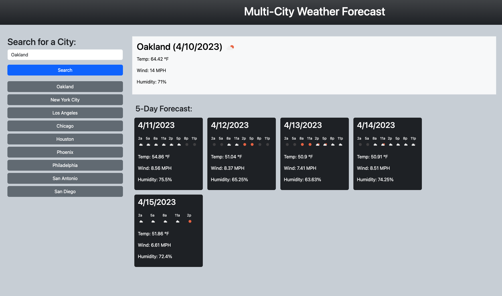

# Multi-City Weather Forecast

This week I'm experimenting with using `fetch` to get and parse information from outside sources. Because they have a free option, I'm going to play around with the APIs over on [openweathermap.org](https://openweathermap.org/). Specifically, I'm going to be looking at the GeoCode API, the Current Weather API, and the 5-day/3-hour Forecast API. 

| **Scenario**                                                                                                                                                                                                                                                                                                                                                                     |
| :------------------------------------------------------------------------------------------------------------------------------------------------------------------------------------------------------------------------------------------------------------------------------------------------------------------------------------------------------------------------------- |
| _When I type a city into a search bar, I want to be presented with information about the weather in that city. I want both the current weather as well as a forecast for the next five days. When I search for another city, my previous search will kept in a list so I can click on it._ |

---

## Finished Product (For Now)

[The deployed application is here.](https://austinzumbro.github.io/multi-city-weather-forecast)

And here is a quick screenshot of what it looks like:


---

## My Approach

### Fetch Data from OpenWeatherMap

The OpenWeatherMap API documents are all pretty straightforward, but the APIs that return weather data all require latitude and longitude figures.  That meant, if I wanted to input a city name, I'd have to convert that into lat/lon figures first.

---

### GeoCode API

This one was simple to use. I used form input to construct a url, and then just ran fetch on it.  The data you get back is a pretty shallow object that's easy to parse.
```javascript
  // Construct the GeoCode API url
  let geoCodeURL =
    "http://api.openweathermap.org/geo/1.0/direct?q=" +
    locationstring +
    "&limit=1&appid=" +
    openWeatherMapAPI;

  // Get the GeoCode
  fetch(geoCodeURL)
    .then(function (response) {
      return response.json();
    })
    .then(function (data) {
      // Parse lat and lon, use them to get weather data
      let lat = data[0].lat;
      let lon = data[0].lon;
      getCurrentWeather(lat, lon);
      get5DayForecast(lat, lon);
    });
```

>The first time I built this, I was running on autopilot and set this all up to run one after the other, declaring `lat` and `lon` as global variables and putting the functions in sequence.
>
>`getGeoCode();`
>
>`getCurrentWeather(lat,lon)`
>
>`get5DayForecast(lat,lon)`
>
>That doesn't work, because `fetch` is asynchronous, and the second two functions were attempting to run before the Geo Code data got returned.

---

### Getting the Current Weather

Next step was getting the current weather. This, again, was pretty straightforward. 

The only tricky bits I ran into were parsing the date as a Unix time stamp and adding the icon to the header tag. The first I solved using DayJS, which I used in a project last week.
>Day.js is super easy to use, but I did get a little tangled up trying to figure out if I needed to apply the "timezone" property to the Unix code returned by OpenWeather. 
>
>After some experimenting and logging to the console, I decided that I did not need to include it... But I question whether or not that's true if I'm looking up cities outside of my local timezone. Eventually, I got tired of playing around with it and decided to just let it be.

```javascript
  fetch(currentWeatherURL)
    .then(function (response) {
      return response.json();
    })
    .then(function (data) {
      // Parse data into variables, then append to page
      // Convert date from unix
      let date = dayjs.unix(data.dt);
      let day = date.format("M/D/YYYY");
      let name = data.name;
      let icon = data.weather[0].icon;
      let iconURL = "https://openweathermap.org/img/wn/" + icon + "@4x.png";
      let h2string =
        name + " (" + day + ") ";
```
Re: the icon, it was easy to pull in the image from a url using the `` element, but I wanted to try to use an `<i>` element since I've seen other people do that. I couldn't figure out a clean way to do it in this case, but I'll try again later.

---

### Getting the 5-Day Forecast

This one got complicated, because the 5-Day forecast returns multiple 3-hour forecasts for each day.  I could have just reported the data for each of those 3-hour time slots, but I decided what I really wanted was to average them out.

This was challenging, because depending on what time of day you run the call, you get back a different number of forecasts for each day in the sequence. You have to actually look at each of the forecasts you get back, check what day it is, store the data for that day in a new list, and then average them out.

So, my plan was:

1. Take the list of 40 3-hour forecasts and iterate over them, building a new object with "days" as keys. 
2. To each of those keys, assign another object with all the data you want: arrays, averages of those arrays, anything else.
3. Then, once that's all done, iterate over that newly reorganized object to build the cards and append them to the page.

You can review the code for the full version, but here's how I set up that object builder:

```javascript
if (!forecastObject.hasOwnProperty(day)) {
            forecastObject[day] = {
              tempArray: [temp],
              windArray: [windSpeed],
              humidityArray: [humidity],
              iconArray: [[time, icon]],
            };
          } else {
            forecastObject[day].tempArray.push(temp);
            forecastObject[day].windArray.push(windSpeed);
            forecastObject[day].humidityArray.push(humidity);
            forecastObject[day].iconArray.push([time, icon]);
          }
```

To summarize, if the day does not exist as a key on the object, create it and populate it with data arrays. If it does exist, push the new data to those arrays.

When it came time to average some of those numbers, I discovered that Javascript doesn't have a native method to average an array (at least not that I saw), so I wrote my own. I also didn't want to overwrite the source data, so I had to generate new keys at the same time.  On top of that, I didn't want to average out the icon data, so I had to put in a `typeof` filter.

```javascript
// Average an array.
function arrayAverage(arr) {
  let sum = 0;
  for (let i = 0; i < arr.length; i++) {
    if (typeof arr[i] === "number") {
      sum += arr[i];
    }
  }
  let average = sum / arr.length;
  let roundedAverage = Math.round(average * 100) / 100;
  // What a weird syntax for rounding!
  return roundedAverage;
}

// Save the average in a new key-value pair.
function avgForecastArrays(obj) {
  for (let x in obj) {
    // Only run on a list of numbers (specific to this app)
    if (typeof obj[x][0] === "number") {
      let newKey = x + "Avg";
      obj[newKey] = arrayAverage(obj[x]);
    }
  }
}
```

---

## Learnings / Reflections

I found this project to be kind of a drag. I was pretty under the weather this week (pun intended), so that might be why. (Parsing object structures with a pounding headache is pretty taxing.) But, ultimately, I think I'm just not that interested in the weather?  

It was fun to play around with `fetch` and explore some of the nuances there. As I mentioned, I got into trouble with asynchronicity, so that was a nice puzzle to solve. And there is something very satisfying about sending off a request and getting back exactly what you expected.

Some improvements to this particular application would be...
- Make the UI more fun and colorful. I used Bootstrap here, theoretically to speed things up, but I probably would have had more fun if I'd just written the CSS myself.
- Make the experience more interactive. I don't really know what that would look like, but the ability to click around on stuff would be nice.

---

## Credits

- [OpenWeatherMap](https://openweathermap.org)
- [Day.js](https://day.js.org/)
- [Bootstrap](https://getbootstrap.com/)

---

## License

MIT License

Copyright (c) 2023 Austin Zumbro

Permission is hereby granted, free of charge, to any person obtaining a copy
of this software and associated documentation files (the "Software"), to deal
in the Software without restriction, including without limitation the rights
to use, copy, modify, merge, publish, distribute, sublicense, and/or sell
copies of the Software, and to permit persons to whom the Software is
furnished to do so, subject to the following conditions:

The above copyright notice and this permission notice shall be included in all
copies or substantial portions of the Software.

THE SOFTWARE IS PROVIDED "AS IS", WITHOUT WARRANTY OF ANY KIND, EXPRESS OR
IMPLIED, INCLUDING BUT NOT LIMITED TO THE WARRANTIES OF MERCHANTABILITY,
FITNESS FOR A PARTICULAR PURPOSE AND NONINFRINGEMENT. IN NO EVENT SHALL THE
AUTHORS OR COPYRIGHT HOLDERS BE LIABLE FOR ANY CLAIM, DAMAGES OR OTHER
LIABILITY, WHETHER IN AN ACTION OF CONTRACT, TORT OR OTHERWISE, ARISING FROM,
OUT OF OR IN CONNECTION WITH THE SOFTWARE OR THE USE OR OTHER DEALINGS IN THE
SOFTWARE.


